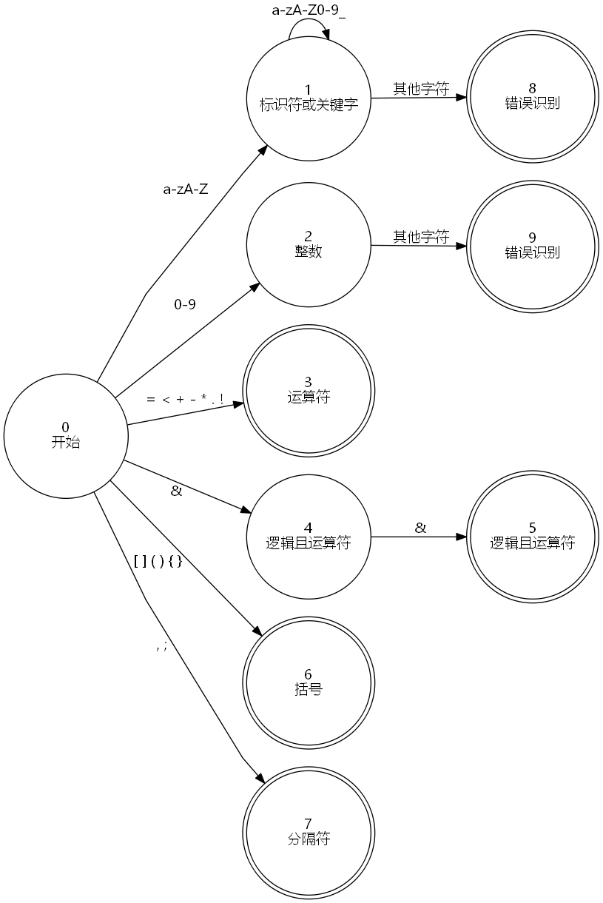

# 词法分析器的设计与实现


## 词法分析的简要步骤与状态转换图


### 词法分析流程


1. 词法分析器从目标源文件逐行读取字符串 `line `。
2. 读取一个字符 `c` ，判断 `c` 的类型：
    1. 若 `c` 为字母，则开始匹配标识符与关键字。
    2. 若 `c` 为数字，则开始匹配整数。
    3. 若 `c` 为 `= | & | < | + | - | * | . | !`，则开始匹配运算符。
    4. 若 `c` 为 `[ ] ( ) { }` ,  则开始匹配括号。
    5. 若 `c` 为 `,;` ，则开始匹配分隔符。
3. 继续读取字符 `s` ，若 `s` 不满足当前路径进一步的要求，则回到开始状态。


### 状态转换图



1. 标识符与关键字需要进一步识别才能区分。
2. 除标识符、关键字和 `&&` 逻辑且运算符外，其他符号都是单字符。
3. 词法分析阶段无法识别括号匹配，只能得出简单的词法错误。


## 词法规则


### 关键字

|       关键字       |        意义        |  标签   |
| :----------------: | :----------------: | :-----: |
|       class        |       声明类       |  CLASS  |
|       public       |    公开访问权限    | PUBLIC  |
|       static       |        静态        | STATIC  |
|        void        |         空         |  VOID   |
|        main        |       主函数       |  MAIN   |
|       String       |       字符串       | STRING  |
|      extends       |        继承        | EXTENDS |
|       return       |        返回        | RETURN  |
|        int         |        整型        |   INT   |
|      boolean       |       布尔值       | BOOLEAN |
|         if         |      条件判断      |   IF    |
|        else        |      条件判断      |  ELSE   |
|       while        |        循环        |  WHILE  |
| System.out.println |      打印整型      |  PRINT  |
|       length       |      长度求值      | LENGTH  |
|        true        |      布尔值真      |  TRUE   |
|       false        |      布尔值假      |  FALSE  |
|        this        | 指向对象自身的指针 |  THIS   |
|        new         |        创建        |   NEW   |


### 符号

| 符号 |   意义   |   标签    |
| :--: | :------: | :-------: |
|  [   | 左方括号 |  LBRACK   |
|  ]   | 右方括号 |  RBRACK   |
|  (   |  左括号  |  LPAREN   |
|  )   |  右括号  |  RPAREN   |
|  {   | 左花括号 |  LBRACE   |
|  }   | 右花括号 |  RBRACE   |
|  ,   |   逗号   |   COMMA   |
|  ;   |   分号   | SEMICOLON |
|  =   |   赋值   |  ASSIGN   |
|  &&  |  逻辑且  |    AND    |
|  <   |   小于   |    LT     |
|  +   |   加号   |    ADD    |
|  -   |   减号   |    SUB    |
|  *   |   乘号   |   MULTI   |
|  .   |   点号   |    DOT    |
|  !   |  逻辑非  |    NOT    |


### 标识符

`Mjava` 标识符正则表达式：

```
identifier = [a-zA-Z][a-zA-Z0-9_]*
```


### 整数

`Mjava` 不支持浮点数，也不支持八进制、十六进制整数，只支持十进制整数，`Mjava` 整数正则表达式：

```
integer = [0-9]+
```

## 词法分析程序的测试方案

词法分析器的测试要点：

1. 关键词与专用符号的解析
2. 标识符的解析与正确性检查
3. 整数的解析与正确性检查

### 测试用例与结果

#### 关键字

|       关键字       |         预期输出         |         实际输出         | 测试结果 |
| :----------------: | :----------------------: | :----------------------: | :------: |
|       class        |       CLASS class        |       CLASS class        |   通过   |
|       public       |      PUBLIC public       |      PUBLIC public       |   通过   |
|       static       |      STATIC static       |      STATIC static       |   通过   |
|        void        |        VOID void         |        VOID void         |   通过   |
|        main        |        MAIN main         |        MAIN main         |   通过   |
|       String       |      STRING String       |      STRING String       |   通过   |
|      extends       |     EXTENDS extends      |     EXTENDS extends      |   通过   |
|       return       |      RETURN return       |      RETURN return       |   通过   |
|        int         |         INT int          |         INT int          |   通过   |
|      boolean       |     BOOLEAN boolean      |     BOOLEAN boolean      |   通过   |
|         if         |          IF if           |          IF if           |   通过   |
|        else        |        ELSE else         |        ELSE else         |   通过   |
|       while        |       WHILE while        |       WHILE while        |   通过   |
| System.out.println | PRINT System.out.println | PRINT System.out.println |   通过   |
|       length       |      LENGTH length       |       LENGTHlength       |   通过   |
|        true        |        TRUE true         |        TRUE true         |   通过   |
|       false        |       FALSE false        |       FALSE false        |   通过   |
|        this        |        THIS this         |        THIS this         |   通过   |
|        new         |         NEW new          |         NEW new          |   通过   |

#### 专用符号

| 符号 |  预期输出   |  实际输出   | 测试结果 |
| :--: | :---------: | :---------: | :------: |
|  [   |  LBRACK [   |  LBRACK [   |   通过   |
|  ]   |  RBRACK ]   |  RBRACK ]   |   通过   |
|  (   |  LPAREN (   |  LPAREN (   |   通过   |
|  )   |  RPAREN  )  |  RPAREN  )  |   通过   |
|  {   |  LBRACE {   |  LBRACE {   |   通过   |
|  }   |  RBRACE }   |  RBRACE }   |   通过   |
|  ,   |   COMMA ,   |   COMMA ,   |   通过   |
|  ;   | SEMICOLON ; | SEMICOLON ; |   通过   |
|  =   |  ASSIGN =   |  ASSIGN =   |   通过   |
|  &&  |   AND &&    |   AND &&    |   通过   |
|  <   |    LT <     |    LT <     |   通过   |
|  +   |    ADD +    |    ADD +    |   通过   |
|  -   |    SUB -    |    SUB -    |   通过   |
|  *   |   MULTI *   |   MULTI *   |   通过   |
|  .   |    DOT .    |    DOT .    |   通过   |
|  !   |    NOT !    |    NOT !    |   通过   |

#### 标识符

| 标识符  |                          预期输出                           |                          实际输出                           | 测试结果 |
| :-----: | :---------------------------------------------------------: | :---------------------------------------------------------: | :------: |
|    a    |                        IDENTIFIER a                         |                        IDENTIFIER a                         |   通过   |
|   abc   |                       IDENTIFIER abc                        |                       IDENTIFIER abc                        |   通过   |
| abc123  |                      IDENTIFIER abc123                      |                      IDENTIFIER abc123                      |   通过   |
| abc_123 |                     IDENTIFIER abc123_                      |                     IDENTIFIER abc123_                      |   通过   |
| abc123_ |                     IDENTIFIER abc123_                      |                     IDENTIFIER abc123_                      |   通过   |
| a1b2_c3 |                     IDENTIFIER a1b2_c3                      |                     IDENTIFIER a1b2_c3                      |   通过   |
| _abc123 | ERROR: Identifiers can not begin with an underscore _abc123 | ERROR: Identifiers can not begin with an underscore _abc123 |   通过   |
| 123abc  | ERROR: Identifiers can not begin with an underscore 123abc  | ERROR: Identifiers can not begin with an underscore 123abc  |   通过   |

#### 整数

|    数字    |                   预期输出                    |                   实际结果                    | 测试结果 |
| :--------: | :-------------------------------------------: | :-------------------------------------------: | :------: |
|     0      |                   INTEGER 0                   |                   INTEGER 0                   |   通过   |
|     10     |                  INTEGER 10                   |                  INTEGER 10                   |   通过   |
| 1234567890 |              INTEGER 1234567890               |              INTEGER 1234567890               |   通过   |
| 0123456789 |              INTEGER 0123456789               |              INTEGER 0123456789               |   通过   |
|    0.0     | ERROR: Floating Numbers are not supported 0.0 | ERROR: Floating Numbers are not supported 0.0 |   通过   |

#### 错误识别

| 字面量 |          预期输出           |          实际结果           | 测试结果 |
| :----: | :-------------------------: | :-------------------------: | :------: |
|   &    | ERROR: Unknown character &  | ERROR: Unknown character &  |   通过   |
|   >    | ERROR: Unknown character >  | ERROR: Unknown character >  |   通过   |
|   \|   | ERROR: Unknown character \| | ERROR: Unknown character \| |   通过   |
|   /    | ERROR: Unknown character /  | ERROR: Unknown character /  |   通过   |

